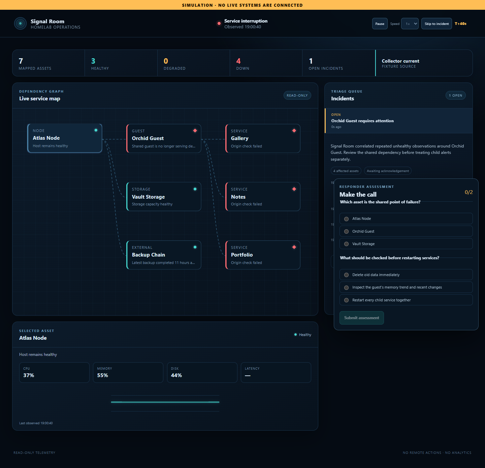

# Signal Room

Signal Room is a read-only, dependency-aware homelab operations console. It combines
privilege-separated Proxmox telemetry, exact backup-job state, constrained HTTPS checks,
and TLS expiry into one service map. Confirmed shared failures become one correlated
incident with an immutable evidence timeline instead of an alert storm.

Signal Room treats `v1.0.0` as supported only when that exact immutable artifact completes
the restore, rollback, resource, Access, Tunnel, firewall, and uninterrupted 24-hour
soak gates recorded in the private release runbook. A release-candidate tag alone
does not imply production promotion.

For the private console, incident workflow, maintenance windows, diagnostics, and the
fictional drill, see the [User guide](USER-GUIDE.md).

Signal Room never receives a shell, SSH agent, Docker socket, service-control API, or
automated remediation capability.

The repository also produces the **Pressure Drop** public drill. That build is fictional,
static, analytics-free, cookie-free, storage-free, and network-isolated.



## Architecture

```text
Proxmox / HTTPS / TLS ── collector ── ingest.sock ─┐
                                                   │
Cloudflare Access ── web ─────────── query.sock ── core ── SQLite
                                                   │
                         signed HTTPS webhook ← notifier
```

Only `signal-room-core` opens SQLite. The collector, web server, notifier, and backup
timer use method-scoped Unix-socket RPC. Each role receives only its own secrets. See
[ARCHITECTURE.md](ARCHITECTURE.md) and [docs/THREAT-MODEL.md](docs/THREAT-MODEL.md).

## Local development

Requirements are Python 3.13 or 3.14, Node.js 22.13 or newer, and npm 10 or newer.

```powershell
python -m venv .venv
.\.venv\Scripts\python.exe -m pip install --require-hashes -r requirements-dev.lock
.\.venv\Scripts\python.exe -m pip install --no-deps -e .
Copy-Item .env.example .env

# One-time schema creation
$env:SIGNAL_ROOM_RUNTIME_ROLE='maintenance'
.\.venv\Scripts\signal-room.exe migrate

# Terminal 1: sole database owner
$env:SIGNAL_ROOM_RUNTIME_ROLE='core'
.\.venv\Scripts\signal-room.exe core

# Terminal 2: fictional collector
$env:SIGNAL_ROOM_RUNTIME_ROLE='collector'
.\.venv\Scripts\signal-room.exe collect

# Terminal 3: private API and built console
$env:SIGNAL_ROOM_RUNTIME_ROLE='web'
.\.venv\Scripts\signal-room.exe serve
```

For frontend hot reload, run `npm ci` and `npm run dev` in `frontend`, then open
`http://127.0.0.1:5173`.

Generate and preview the isolated public drill:

```powershell
$env:SIGNAL_ROOM_RUNTIME_ROLE='maintenance'
.\.venv\Scripts\signal-room.exe export-demo
Set-Location frontend
npm run build:demo
npm run preview:demo
```

## Verification

```powershell
.\.venv\Scripts\python.exe -m ruff check .
.\.venv\Scripts\python.exe -m mypy backend/signal_room
.\.venv\Scripts\python.exe -m pytest --cov-fail-under=90
.\.venv\Scripts\python.exe -m pip_audit -r requirements.lock
Set-Location frontend
npm run lint
npm run typecheck
npm test
npm run build
npm audit --audit-level=high
npm run test:e2e
```

`python scripts/build-release.py` creates separate allowlisted private and public bundles,
a universal application wheel, a Python 3.13 Linux wheelhouse, CycloneDX SBOMs, and
SHA-256 manifests. Server installation is offline and transactional; it never copies an
arbitrary repository tree.

## Deployment boundary

The private target is a clean unprivileged container of its own. a separate backup container and its backup archives remain
untouched. The public demo is deployed only from the public static bundle. No script in
this repository creates or changes a Proxmox guest, token, firewall, backup job, DNS
record, Cloudflare Tunnel, Access application, or Pages project automatically. Follow
the private deployment runbook, which is deliberately not published: it maps real
infrastructure, so it stays out of this repository.

## Licence

MIT. See [LICENSE](LICENSE).
